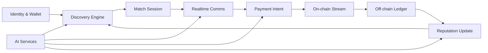

# Master Blueprint: PayTray as an Integrated AI Platform

## Blueprint Goal

Yes, the three capabilities can be integrated into one coherent platform, but only if PayTray is treated as a coordination system, not three loosely connected features. The current repo shows promising domain modules but also hard integration risks that will block “seamless” behavior unless fixed first.

### Core Architectural Truth

1. Expert discovery creates intent.
2. Real-time communication converts intent to engagement.
3. Payments convert engagement to trust and retained value.
4. AI improves conversion quality across all three, but only if data contracts and reliability are stable.

Without that sequencing, AI amplifies noise.

---

## Current Reality Check (Grounded in Repo + Audit)

Critical baseline gaps from the audit are visible in code and must be resolved before platform-level integration:

1. Startup/runtime fragility in backend composition: server.js:43, server.js:366
2. Conflicting payment stream route behavior: server.js:447, server.js:704
3. Placeholder cryptographic verification path: security.js:78
4. Silent DB fallback that can mask failures: database.js:44, database.js:71
5. Docs/tests drift from active API reality: api.test.js:197, README.md, README.md

These are not cosmetic. They directly affect your ability to make discovery, communication, and payments feel like one product.

---

## System Architecture

Design the platform as five bounded domains:

### 1) Identity and Trust

Wallet, auth, session, identity linking, role claims.

Existing seeds: security.js, errors.js

### 2) Discovery and Reputation

Expert profile indexing, matching, ranking, reputation.

Existing seeds: ceramicService.js, Ceramic.jsx

### 3) Communication and Collaboration

Presence, messaging, call session lifecycle, meeting artifacts.

Existing seeds: communicationAdapter.js, server.js

### 4) Payments and Ledger Consistency

Stream creation, state transitions, reconciliation, dispute primitives.

Existing seeds: sablierService.js, paymentStreamAdapter.js, 001_init.sql

### 5) Intelligence and Risk

Matching quality, assistant guidance, fraud/risk scoring, quality analytics.

Mostly missing as first-class runtime layer today.

### Suggested Interaction Model

### Where Architecture Is Elegant

1. Natural closed loop from matching to engagement to payout to reputation.
2. Payment stream metadata can become a credibility signal for ranking.
3. Real-time layer can carry payment confirmations and trust signals.

### Where You Are Forcing It

1. Decentralized profile storage as primary source before robust off-chain reliability.
2. Tight coupling between chat events and payment side-effects too early.
3. Multi-chain ambition before single-chain operational correctness.

---

## Expert Discovery Engine

Use a hybrid retrieval and ranking stack.

### Candidate Generation

1. Filters: domain, availability, budget, timezone, language, chain preference.
2. Retrieval: keyword + semantic embedding over profile/bio/work evidence.
3. Data source should be off-chain index first, with on-chain attestations as signals.

### Ranking

Ranking score combines:

1. Expertise relevance
2. Outcome history
3. Response latency
4. Conversion rate from intro call to paid session
5. Payment completion reliability
6. User-to-expert affinity features

Avoid end-to-end neural ranking initially. Start with interpretable weighted ranker and offline evaluation.

### Feedback Loop

Post-session outcomes feed ranking:

1. Meeting completed
2. Paid minutes delivered
3. No-show/dispute rate
4. Repeat booking rate

This creates moat faster than adding model complexity.

### Needs From Communication Layer

1. Reliable response-time and meeting attendance events.
2. Message intent classification for urgency and fit signals.

### Needs From Payments Layer

1. Settled payment confirmations.
2. Stream continuity/cancel events.
3. Dispute or reversal flags.

### Risk Today

Profile data split between local frontend storage and backend paths weakens trust scoring consistency: Ceramic.jsx, CeramicProvider.jsx

---

## Real-Time Communication Layer

Build communication as event-native but not payment-authoritative.

### What to Support

1. Presence
2. Messaging
3. Call rooms
4. Lightweight shared artifacts (notes, links, files)
5. Event hooks for payment-required, payment-active, payment-interrupted

### Coupling Strategy

1. Tight coupling to discovery is worth it.
2. Immediate handoff after match drives conversion.
3. Context card from discovery should prefill intro prompts.
4. Loose coupling to payments is safer.
5. Chat should reflect payment state, not own settlement logic.
6. Payment side-effects should flow from payment domain events into chat notifications.

### Why

If blockchain latency or RPC issues block messaging UX, users churn before monetization.

### Current Seeds and Risks

Communication adapter pattern exists but has fallback abstractions that can hide degradation: communicationAdapter.js

---

## Decentralized Blockchain Payments

### Recommendation

1. Start with one settlement chain for reliability.
2. Arbitrum or Base for lower fees and faster UX, while preserving Ethereum compatibility.
3. Keep Ethereum mainnet as trust anchor/attestation layer, not first transactional path.
4. Add chain abstraction only after stream lifecycle correctness metrics are stable.

### Wallet Integration

1. SIWE-style authentication with nonce and expiry.
2. Session claims for roles and permissions.
3. Optional social identity link for discovery trust.

### Transaction Confirmation UX

Show three states:

1. Submitted
2. Included/finalized
3. Reflected in platform ledger

Never treat wallet signature alone as economic finality.

Provide explicit fallback/retry action when chain confirmation stalls.

### Settlement Timing Friction

1. User expectation in chat is immediate.
2. Chain settlement is probabilistic and delayed.
3. Solve with dual ledger:
   - On-chain source of truth for money
   - Off-chain operational ledger for UX continuity + reconciliation jobs

### Current Risk Indicators

1. Sablier service contains simulation/placeholder behavior in critical paths: sablierService.js
2. Conflicting endpoint semantics increase mismatch risk: server.js:447, server.js:704

---

## AI Integration Points (What Actually Moves the Needle)

### High-Value AI Now

1. Matching quality improvement: learning-to-rank on conversion and completion outcomes.
2. Conversation assist: session objective extraction, next-best-question suggestions.
3. Transaction safety assistant: detect suspicious payment requests, mismatched addresses, abnormal pricing.
4. Fraud and trust: graph/anomaly scoring over booking/payment/dispute behavior.
5. Post-session synthesis: structured summaries and action items for repeat engagement.

### Lower-Value Hype for Now

1. Fully autonomous deal negotiation agents.
2. Generic chatbots without closed-loop performance metrics.
3. Heavy LLM orchestration before event/data quality is solved.

### Technique Recommendations

1. Retrieval + embeddings for profile/context matching.
2. Gradient boosted ranking model for interpretable ranking baseline.
3. Light LLM for explanation/guidance, not authority.
4. Rules + anomaly model hybrid for fraud.

---

## Data Model and Security

### Core Entities

1. User: internal id, wallet(s), auth state, role, risk score.
2. ExpertProfile: skills, rates, availability, proof links, verification status.
3. MatchSession: search context, candidate set, ranking explanation, chosen expert.
4. ConversationThread: participants, presence, message timeline, call references.
5. EngagementContract: scope, pricing mode, cancellation policy, expected duration.
6. PaymentStream: chain, stream id, status state machine, cumulative settled amount.
7. ReputationEvent: outcome artifacts from communication + payment domains.
8. TrustSignal: fraud flags, dispute records, verification outcomes.

### On-Chain vs Off-Chain

On-chain:

1. Settlement events
2. Critical attestations
3. Dispute anchors

Off-chain:

1. Search index
2. Chat content
3. Ranking features
4. Analytics
5. Operational state

Tradeoff:

1. On-chain maximizes verifiability but hurts latency/cost/privacy.
2. Off-chain maximizes UX and product iteration speed.
3. Best architecture is hybrid with deterministic reconciliation.

### Auth Across Layers

1. Wallet-based primary auth with challenge-response nonce.
2. Short-lived access tokens with scopes.
3. Service-to-service signing for event integrity.
4. Strict separation between user auth and payment authorization.

### Immediate Security Gap to Address

Placeholder wallet signature verification: security.js:78

---

## Implementation Roadmap (Build Sequence and Early Value)

### Phase A: Stabilize Platform Core (2-4 weeks)

1. Resolve backend startup/runtime contract defects.
2. Normalize payment and profile API contracts.
3. Replace silent fallback behavior with explicit degraded states.
4. Rebuild endpoint tests to match live contracts.

Goal: make system behavior trustworthy.

### Phase B: MVP Coherence Loop (4-6 weeks)

1. Discovery v1 (structured filters + simple ranking).
2. Match-to-chat handoff with context payload.
3. Single-chain payment stream integration with clear state UX.
4. Reputation event capture from session outcomes.

Goal: validate core product loop with real users.

### Phase C: Intelligence and Quality Lift (6-8 weeks)

1. Ranking model trained on conversion outcomes.
2. Conversation assistant for meeting goals and summaries.
3. Fraud/risk scoring for payment anomalies.

Goal: measurable conversion and trust improvement.

### Phase D: Scale and Resilience (8-12 weeks)

1. Multi-chain expansion only if payment reliability target hit.
2. Queue hardening, reconciliation pipelines, observability SLOs.
3. Public developer APIs and extension points.

Goal: external developer adoption + operational confidence.

### Smallest Validating Version

1. One expert vertical
2. One real-time channel
3. One chain
4. One payment mode
5. One ranking baseline

This is enough to test willingness to pay and repeat engagement.

---

## Technical Tradeoffs and Debt to Accept Consciously

1. Start off-chain heavy for speed.
   - Debt: later trust portability work.
2. Single-chain first.
   - Debt: cross-chain demand from power users.
3. Simple ranking first.
   - Debt: suboptimal matching until sufficient data.
4. Loose payment-chat coupling.
   - Debt: less magical first UX, but safer failure isolation.
5. Strict failure transparency over graceful fakery.
   - Debt: more visible errors early, but better long-term trust.

### Precarious Decisions to Monitor

1. Any silent fallback in financial or identity paths.
2. Divergent schemas across frontend, backend, and chain events.
3. Documentation that claims capabilities not enforced in runtime.
4. Expanding to multi-chain before reconciliation quality is proven.

---

## How This Blueprint Addresses Audit Findings

1. Audit: runtime fragility and contract drift.
   - Blueprint response: Phase A stabilization and contract-first API model.
2. Audit: placeholder cryptographic/payment logic.
   - Blueprint response: hardening identity and single-chain reliability before expansion.
3. Audit: weak evaluation discipline.
   - Blueprint response: phased outcome metrics tied to conversion, completion, and trust.
4. Audit: missing AI core.
   - Blueprint response: AI added only at leverage points with measurable impact, not broad speculative automation.
5. Audit: fallback-heavy architecture masking risk.
   - Blueprint response: explicit degraded states + reconciliation and SLO-driven operations.

---

## Feasibility Answer

The integrated product is buildable and strategically coherent, but only if you treat reliability and contract integrity as prerequisites, not polish.

Seamless is expensive because it requires:

1. Cross-domain event consistency
2. Deterministic payment-state UX
3. Trustworthy identity/auth
4. Closed-loop outcome data for AI quality

If you sequence correctly, you can ship meaningful value before full-stack perfection and still preserve a path to a defensible AI-native payment platform.
