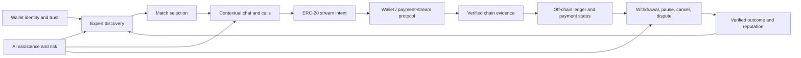

# Paytray Engineering Audit: Time-to-Money Platform

**Author:** Manus AI  
**Date:** 2026-08-14  
**Repository baseline:** `ae7c6c6` on `master`  
**Product framing:** Corrected and verified

## Executive synthesis

Paytray is an **AI-enabled platform for flexible freelancer-client engagement**. It connects expert discovery, real-time collaboration, and ERC-20 payment streams so parties can fund time continuously rather than depend solely on lump-sum payments. The product’s defensibility comes from a trusted closed loop: a client finds the right provider, enters a contextual engagement, streams value for work in progress, and produces verified outcome signals that improve future discovery. [1] [2]

The repository is deliberately a Phase 1 backend skeleton. It has useful foundations for wallet challenges, scoped tokens, profiles, discovery, match handoff, conversation artifacts, payment-stream state, operational primitives, and baseline integration coverage. It does **not** yet contain a real payment-stream protocol integration, a chain indexer, persistent domain repositories, a client experience, or a model-provider/retrieval layer. The primary risk is therefore not that Paytray lacks vision; it is that simulated, process-local payment state could be mistaken for financial truth before the on-chain and durable-accounting boundaries are built. [1] [3]

The correct build sequence is to protect the time-to-money loop first: establish stream authority, chain evidence, exact accounting, and withdrawal/cancellation semantics; then make the engagement experience resilient and clear; then apply AI to match quality, provider productivity, and risk operations with measurable outcomes. This audit replaces all prior characterizations that described Paytray as a token-generation product.

## Product loop and capability boundary

| Capability | Repository state | Audit interpretation |
|---|---|---|
| Wallet identity and scoped login | Implemented skeleton | Challenge-first wallet login and scope claims are present. |
| Expert discovery and match handoff | Implemented skeleton | Structured filters, heuristic ranking, match sessions, and conversation threads exist. |
| Real-time collaboration | Contracted skeleton | LiveKit token issuance exists; no tracked frontend/session orchestration exists. |
| ERC-20 payment stream | Simulated lifecycle | Records hold token symbols, amount, duration, and confirmation labels; no protocol transaction, token address, receipt, or finality proof is implemented. |
| Withdrawal and cancellation | Simulated lifecycle | The backend mutates `withdrawn` and status locally; it does not invoke an on-chain protocol. |
| Accounting and reconciliation | Prototype | An in-memory off-chain ledger and snapshot exist; no immutable database journal or indexer exists. |
| AI assistance | Heuristic prototype | Keyword suggestions, ranking weights, and risk rules exist; no model/provider, retrieval, or evaluation infrastructure exists. |

## System scorecard

| Domain | Score / 5 | Product consequence |
|---|---:|---|
| Payment-stream authority | 1 | User-facing states can drift from actual chain reality. |
| ERC-20 asset correctness | 0 | Symbols and JavaScript numbers cannot safely represent arbitrary ERC-20 contracts or decimals. |
| Ledger and reconciliation | 1 | Prototype accounting cannot be authoritative across restart or multiple workers. |
| Identity and authorization | 3 | Wallet challenges/scopes are present; durable session controls and operator separation are incomplete by default. |
| Discovery and matching | 2 | Usable filters exist, but no retrieval corpus, outcome lineage, or anti-gaming layer exists. |
| Real-time engagement | 1 | Basic token endpoint exists but no service lifecycle, presence, or user experience is tracked. |
| AI assistance | 1 | Rules are helpful scaffolding, not a governed AI capability. |
| Reliability and operations | 2 | Snapshots, retries, and SLO-shaped outputs exist but remain process-local. |
| Security | 2 | Strong seeds exist, but chain authority, webhook egress, distributed controls, and key governance require work. |
| Evaluation and developer experience | 2 | 58 endpoint integration tests pass; no load, restart, chain-simulation, or AI-quality harness exists. |

## Top 20 product-critical findings

| Rank | ID | Severity | Evidence | Failure scenario | Recommended correction | Estimate |
|---:|---|---|---|---|---|---:|
| 1 | PAY-001 | Critical | Observed | A participant marks a stream `included` and then `reflected` through the API without verified chain evidence, leading a client or provider to trust a payment state that the protocol has not established. | Replace participant-driven confirmation with a chain-event verifier. Persist transaction hash, chain, contract, log index, block, finality status, and an immutable event record; only the verifier may mark `reflected`. | 4–6 weeks |
| 2 | PAY-002 | Critical | Observed | An amount is stored as JavaScript `Number` and a token as a symbol such as `USDC`; an arbitrary ERC-20’s contract address and decimals are lost, enabling rounding, ambiguity, or wrong-asset errors. | Represent token as allowlisted contract address plus chain ID and decimals; store base-unit amounts as decimal strings/bigints and validate with protocol-specific serializers. | 2–3 weeks |
| 3 | PAY-003 | Critical | Observed | Stream, ledger, idempotency, and queue state live in local Maps and a JSON snapshot. Restart or multi-instance traffic can create divergent payment status or duplicate accounting. | Move payment intent, stream state, idempotency, chain events, ledger entries, and outbox records to Postgres; enforce uniqueness and transact state changes. | 6–10 weeks |
| 4 | PAY-004 | High | Observed | The platform treats an internally writable `withdrawn` field as withdrawal accounting even though no smart-contract withdrawal event has been verified. | Model requested withdrawal separately from verified withdrawal events and surface only chain-confirmed availability as economic truth. | 3–5 weeks |
| 5 | PAY-005 | High | Observed | `Map.size + 1` generates stream and job identifiers. Restores, deletes, and concurrent actors can collide or misreference a time-payment agreement. | Use UUID/ULID IDs and database uniqueness; retain protocol identifiers separately. | 1–2 weeks |
| 6 | PAY-006 | High | Observed | Reconciliation originally credited every reflected stream on every run. A local marker now prevents duplicate process-local credits, but no durable journal exists. | Preserve the local marker as a guardrail, then replace it with append-only double-entry ledger entries constrained by `(source_event_id, entry_type)`. | 2–4 weeks |
| 7 | PAY-007 | High | Observed | Cancellation, pause, finality, and dispute semantics are not bound to a selected streaming protocol. Providers and clients cannot safely infer what they can withdraw after a stop or dispute. | Select the protocol and document explicit lifecycle semantics, including authority, grace, cancellation, withdrawal, and dispute behavior. | 2–3 weeks design |
| 8 | SEC-001 | High | Observed, fixed locally | Refresh JWTs could previously function as bearer access tokens. | Retain the implemented `type: access` and issuer enforcement; add refresh rotation/revocation before exposing a refresh endpoint. | Completed locally; 2 weeks for rotation |
| 9 | SEC-002 | High | Observed, fixed locally | Ordinary wallets previously received `ops:*`, allowing control-plane actions unrelated to a client/provider engagement. | Retain explicit operator-wallet configuration; persist roles and audit operator actions before production. | Completed locally; 2–3 weeks durable RBAC |
| 10 | SEC-003 | High | Observed | Extension-hook registration accepts arbitrary HTTP(S) destinations; server-side delivery can expose internal services to SSRF. | Enforce egress policy, private-IP/DNS-rebinding blocks, redirect denial, timeouts, quotas, and hook audit logs. | 1–2 weeks |
| 11 | SEC-004 | High | Observed | Challenges, rate limits, idempotency keys, and service state are node-local. A horizontally scaled service can lose security state or split rate-limit enforcement. | Store TTL security state in Redis/Postgres and validate proxy topology. | 2–3 weeks |
| 12 | ENG-001 | High | Observed | Collaboration tokens, messages, and artifacts are backend contracts without a tracked engagement UX. Chain delay or payment degradation has no product-grade fallback display. | Build a client state model that separates collaboration availability from payment status, with explicit “submitted/included/finalized/reflected” messaging. | 4–6 weeks |
| 13 | DISC-001 | High | Observed | Ranking learns from mutable reputation events that an authenticated caller can attribute to another wallet, allowing outcome poisoning. | Derive reputation features from verified engagement, payment, and dispute events; retain manually reported feedback as non-authoritative. | 2–4 weeks |
| 14 | AI-001 | High | Observed | Conversation assistance and synthesis use heuristics without model policy, source provenance, evaluation, or human override. | Add provider abstraction, versioned prompt/structured-output contracts, evaluation fixtures, data minimization, and opt-in/override UX. | 4–6 weeks |
| 15 | REL-001 | High | Observed | Webhooks and queue jobs run through request-triggered, process-local loops, which couple user traffic to recovery work. | Introduce durable queue workers, exponential backoff with jitter, dead-letter handling, and event idempotency. | 3–5 weeks |
| 16 | ARCH-001 | Medium | Observed | A single 3,153-line server coordinates every product domain, making payment changes risky and preventing isolated testing. | Extract identity, discovery, engagement, payments, ledger, intelligence, and operations services behind narrow interfaces. | 6–10 weeks |
| 17 | REL-002 | Medium | Observed | Snapshot restore has no schema validation, migration, checksum, or quarantine behavior. | Validate and quarantine snapshots as an immediate guardrail; remove snapshots from authoritative payment paths after database migration. | 1–2 weeks |
| 18 | OBS-001 | Medium | Observed | SLO output is based on process-local counters; there is no trace from a client engagement to payment intent, chain event, ledger entry, and webhook. | Add correlation IDs, traces, durable event history, and payer/provider-facing support views. | 2–3 weeks |
| 19 | API-001 | Medium | Observed | Current contracts lack OpenAPI, version policy, pagination, and canonical error codes. | Publish versioned OpenAPI contracts and generated clients before a frontend or external integration pilot. | 2–3 weeks |
| 20 | EVAL-001 | Medium | Observed | Tests validate endpoint flows but not chain reorgs, duplicate events, restarts, multi-instance execution, stream timing, decimal precision, or AI quality. | Add protocol-adapter tests, ledger property tests, concurrency/restart tests, and an AI evaluation corpus. | 3–5 weeks |

## Completed protective groundwork

Three changes already exist in the working copy and remain correct under the clarified product model because they protect client/provider accounts and operational integrity rather than impose a product identity.

| Change | Why it serves Paytray’s real product |
|---|---|
| Refresh tokens are rejected on protected routes. | A long-lived credential cannot impersonate a client or provider in an active engagement. |
| `ops:*` is assigned only to configured operator or administrator wallets. | Clients and providers cannot access platform control-plane functions by default. |
| Reconciliation records a local per-stream completion marker. | A repeated local reconciliation does not multiply a provider’s displayed ledger credit. |

These are only guardrails around the current skeleton. They do not replace a smart-contract integration, verified chain indexer, or durable ledger.

## Correct implementation roadmap

| Phase | Focus | Completion outcome |
|---|---|---|
| 1. Payment truth | Select stream protocol and supported chain/token policy; create adapter contract, token/decimal model, verified chain-event schema, and lifecycle specification. | The service can distinguish user intent from protocol-confirmed economic truth. |
| 2. Durable financial core | Move payment, idempotency, chain-event, ledger, and outbox state to Postgres; use UUIDs and append-only journal entries. | Retry, restart, and concurrency cannot create duplicate financial records. |
| 3. Engagement MVP | Build client/provider flows for discovery, match handoff, collaboration, and payment-state UX. | A pilot can complete an engagement without hiding payment uncertainty. |
| 4. Operations and safety | Deploy workers, observability, webhook policy, incident runbooks, and support tooling. | Payment and engagement failures are detectable and recoverable. |
| 5. AI quality loop | Add governed matching, provider/client preparation, conversation summaries, and risk triage with evaluations. | AI improves conversion and trust with measurable outcomes. |
| 6. Protocol and ecosystem expansion | Add additional allowed tokens/chains only after finality, reconciliation, and support metrics meet gates. | Expansion preserves payment correctness and user trust. |
| 7. Advanced research | Explore richer pricing, negotiated engagement contracts, and adaptive assistance behind safety/evaluation gates. | New features are measurable and reversible. |

## Next build decision

The next correct product implementation is a **durable, verifier-owned payment-stream production path**, not another simulated endpoint. PayTray now uses Sablier Flow v3 on Base Sepolia (`84532`) as the initial testnet candidate, with an allowlisted token model, official ABI-backed decoder, durable chain-event evidence, ledger idempotency, finality promotion, reconciliation, and operator review gates. Base mainnet remains explicitly disabled unless production authorization is configured. [3] [4]

## References

[1]: https://github.com/OxCryptobot/PAYTRAY
[2]: https://github.com/OxCryptobot/PAYTRAY/blob/master/README.md
[3]: https://github.com/OxCryptobot/PAYTRAY/blob/master/packages/backend/server.js
[4]: https://github.com/OxCryptobot/PAYTRAY/blob/master/packages/backend/lib/config.js
[5]: https://github.com/OxCryptobot/PAYTRAY/blob/master/MasterBlueprint.md
